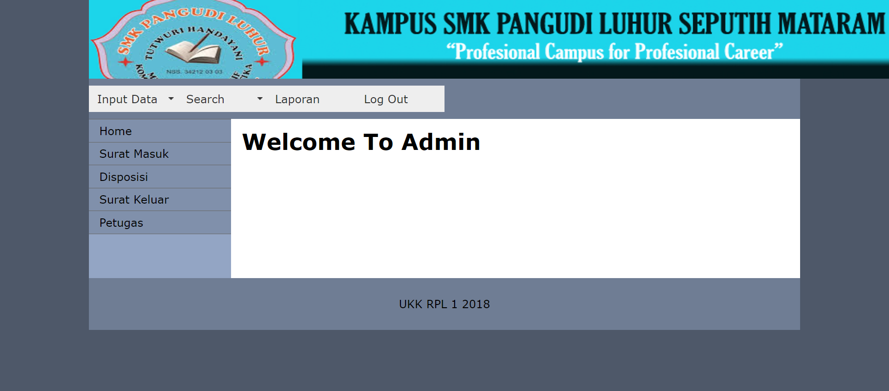

# UKK (Ujian Kompetensi Keahlian): Aplikasi Pengarsipan Surat Masuk dan Surat Keluar Berbasis Web
================================================
Mar 2018 - Mar 2018

Membuat sistem untuk pengarsipan surat masuk dan surat keluar yang terdiri dari 2 web yaitu:

- Web untuk Administrator
- Web untuk Petugas

### Teknologi yang digunakan:

- MySQL

### Software tool:

- Dreamweaver
- Xampp

### Bahasa:

- PHP
- HTML
- CSS

# Preview

### Screenshot

### Aplikasi Pengarsipan Surat Masuk dan Surat Keluar Berbasis Web

